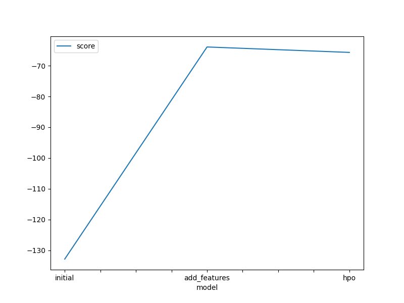

# Report: Predict Bike Sharing Demand with AutoGluon Solution
#### NAME HERE

## Initial Training
### What did you realize when you tried to submit your predictions? What changes were needed to the output of the predictor to submit your results?
I first ran the model, all of the predicted values were possitive so didn't need to change all negative values to zero.

### What was the top ranked model that performed?
WeightedEnsemble_L2

## Exploratory data analysis and feature creation
### What did the exploratory analysis find and how did you add additional features?
I converted the `datetime` feature type from `object` to pandas `datetime` object and extracted the only the hour section from the feature and later droped the datetime feature itself. I also converted `weather` and `season`features from `object` type to `category` type.

### How much better did your model preform after adding additional features and why do you think that is?
Adding a new featured reduced the error by `1.29802`. A good linear regression model that is evaluated with Root Mean Squared Error (RMSE) metric will have a lower RMSE value. 

## Hyper parameter tuning
### How much better did your model preform after trying different hyper parameters?
Adding a new featured reduced the error. Some of the hyper parameter increased the error.

### If you were given more time with this dataset, where do you think you would spend more time?
I would spend more time to understand the data and try different new engineered features. With more compute, I would try different hyper parameters and allocate more time limit for better performance.

### Create a table with the models you ran, the hyperparameters modified, and the kaggle score.
|model|hpo1|hpo2|hpo3|score|
|--|--|--|--|--|
|initial|learning_rate | extra_trees | depth | 0.68241 |
|add_features|learning_rate	| extra_trees | depth | 0.58389|
|hpo|learning_rate | n_estimators | iteration | 0.54056 |

### Create a line plot showing the top model score for the three (or more) training runs during the project.

### Create a line plot showing the top kaggle score for the three (or more) prediction submissions during the project.

## Summary
The notebook outlines a full AutoGluon workflow to predict bike-sharing demand. Steps included setting up a Kaggle API, downloading the dataset, performing exploratory data analysis (EDA), creating new features (e.g., extracting hour from datetime), and training models. Hyperparameter tuning was applied using AutoGluon’s hyperparameters and hyperparameter_tune_kwargs. Model performance improved progressively, with the RMSE decreasing from 1.79 (initial model) to 0.54 after feature engineering and tuning. The final output was saved for submission, showing significant gains from stepwise enhancements.